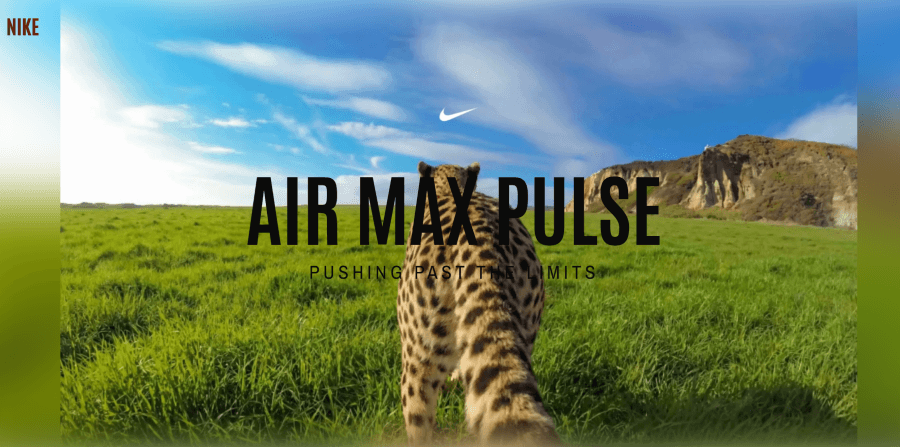
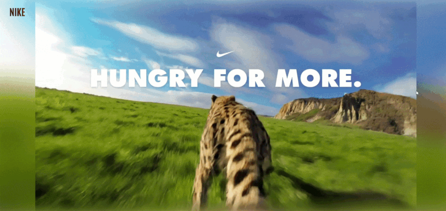

# Nike Air Max Pulse – Scrollytelling Landing Page

A cinematic Nike-inspired landing page featuring a frame-by-frame cheetah animation powered by a dual-canvas rendering engine and scroll-driven storytelling.



## Demo

### Scroll-driven cinematic landing experience inspired by Nike campaigns



## Features

• Frame-by-frame cheetah animation (242 frames)  
• Dual canvas rendering system  
• GSAP ScrollTrigger animation  
• Smooth scroll interaction  
• Responsive landing page layout

### 🛠 Tech Stack


## How It Works

The hero animation is rendered using a canvas-based frame sequence synced with scroll position using GSAP ScrollTrigger.

## Live Demo

https://demo-link.com

## Run Locally

```bash
git clone https://github.com/Afsal-Palliyal/nike-airmax-pulse.git
cd nike-airmax-pulse
open index.html
```
